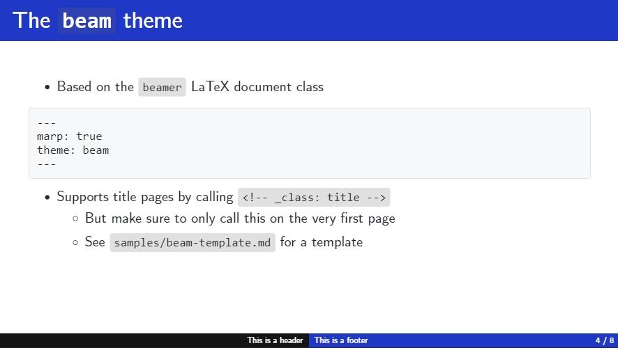
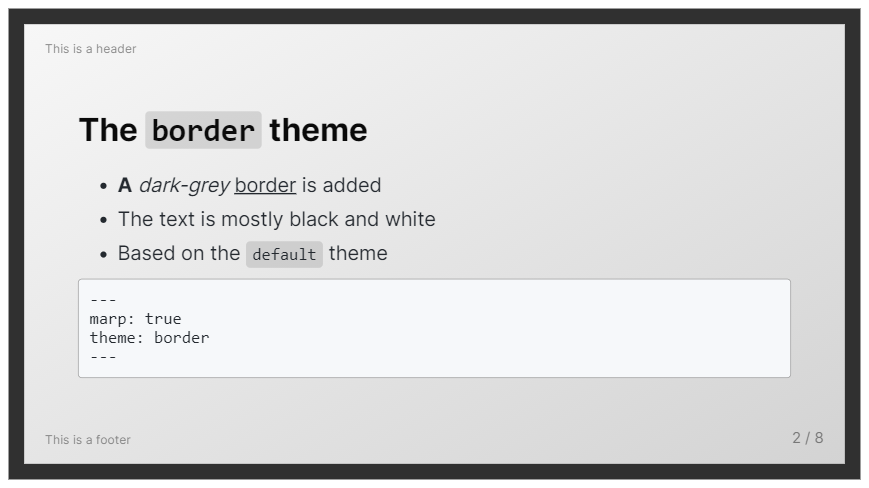
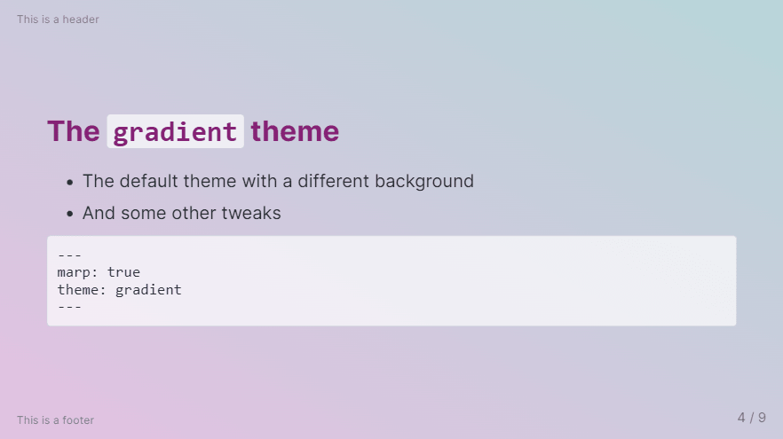
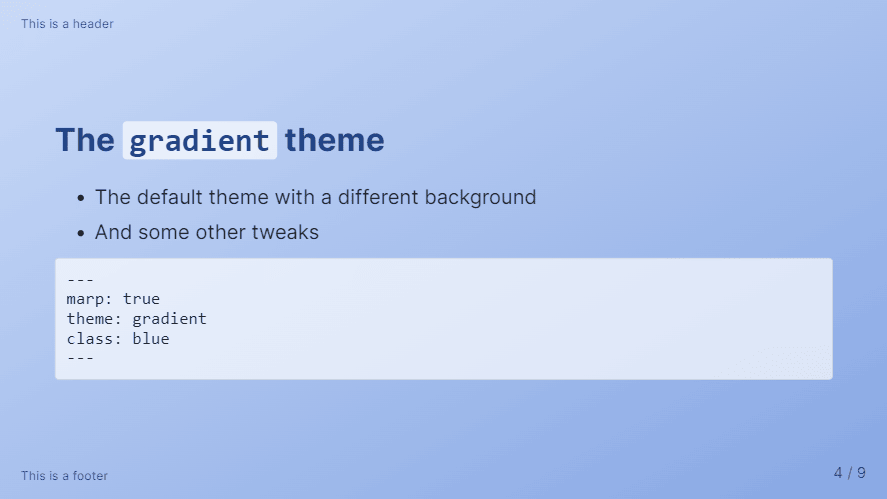
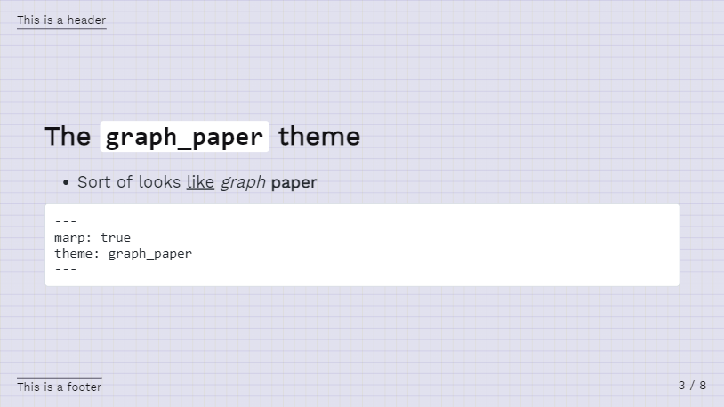

# My custom Marp themes

[Marp](https://marp.app/) is used to create presentations in Markdown. In this repository, you may find simple CSS themes that I have created.


## `beam`

- Inspired by / based on [LaTeX's beamer class](https://github.com/josephwright/beamer)

> [!TIP]
>
> - Download and install the [Computer Modern Unicode font family](https://ctan.org/pkg/cm-unicode?lang=en) for best results
>
> - Follow the [tutorial](how-to/beam_custom.md) to change the primary colors


**Download the CSS file:**

```
https://rnd195.github.io/my-marp-themes/beam.css
```

More screenshots on the [community themes website](https://rnd195.github.io/marp-community-themes/theme/beam.html)



---

## `border`

- Based on the `default` Marp theme

> [!NOTE]
>
> The theme imports a font from Google Fonts (see *Privacy notice* below)


**Download the CSS file:**

```
https://rnd195.github.io/my-marp-themes/border.css
```

More screenshots on the [community themes website](https://rnd195.github.io/marp-community-themes/theme/border.html)



---

## `gradient`

- Based on the `default` Marp theme

> [!NOTE]
>
> The theme imports a font from Google Fonts (see *Privacy notice* below)


**Download the CSS file:**

```
https://rnd195.github.io/my-marp-themes/gradient.css
```

More screenshots on the [community themes website](https://rnd195.github.io/marp-community-themes/theme/gradient.html)



- `gradient`, class `blue`



---

## `graph_paper`

- Based on the `default` Marp theme

> [!NOTE]
>
> The theme imports a font from Google Fonts (see *Privacy notice* below)


**Download the CSS file:**

```
https://rnd195.github.io/my-marp-themes/graph_paper.css
```

More screenshots on the [community themes website](https://rnd195.github.io/marp-community-themes/theme/graph_paper.html)



---

# Installation

For users of the VSCode Marp extension:

1. Open Settings in VSCode (`Ctrl + ,`)
2. Search for "Marp: Themes" or "markdown.marp.themes"
3. Add either 
   - A local path to the CSS file
   - Or a link to the CSS file
     - Please, instead of linking to the raw file on GitHub, consider forking the repository and hosting the CSS files yourself (using, for example, GitHub Pages)
4. Enable the theme in the front-matter of the Markdown document, i.e., write the following at the very beginning of the Markdown document:

```
---
marp: true
theme: theme_name
---
```

5. Try restaring VSCode if it doesn't work right away

Below is a template for some common settings using the `graph_paper` theme:

```
---
marp: true
theme: graph_paper
paginate: true
size: 4:3
header: This is a header
footer: This is a footer
title: Marp custom themes
---
```

Follow the [official documentation](https://github.com/marp-team/marp/blob/main/website/docs/guide/directives.md) for more options.


# License

The `beamer`-inspired `beam` theme is licensed under [GNU GPLv3](https://github.com/rnd195/my-marp-themes/blob/live/licenses/LICENSE_beam). Parts of the `beamer` class are [dual-license](https://github.com/josephwright/beamer/blob/main/LICENSE.md) with one option being the [GNU GPLv2](https://github.com/rnd195/my-marp-themes/blob/live/licenses/LICENSE_GPLv2). The rest of the repository is licensed under the [MIT License](https://github.com/rnd195/my-marp-themes/blob/live/licenses/LICENSE).


# Attribution

The `beam`, `border`, `graph_paper`, and `gradient` themes are based on the `default` Marp themes made by [yhatt](https://github.com/marp-team/marp-core/tree/main/themes). The `border` and `gradient` themes import the [Inter](https://fonts.google.com/specimen/Inter) font by [Rasmus Andersson](https://rsms.me/). The `graph_paper` theme imports the [Work Sans](https://github.com/weiweihuanghuang/Work-Sans) font by [Wei Huang](https://github.com/weiweihuanghuang).


# Privacy notice

Please, be aware that by using some of the CSS themes (namely `border`, `gradient`, and `graph_paper`) you import fonts from the Google Fonts service. Please, refer to their [Privacy FAQ](https://developers.google.com/fonts/faq/privacy) for more information about using their service.

The CSS files are also hosted on the GitHub Pages site of this repository (deployed from the `live` branch). The site is automatically built after each commit.

